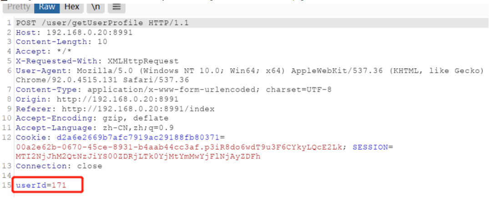
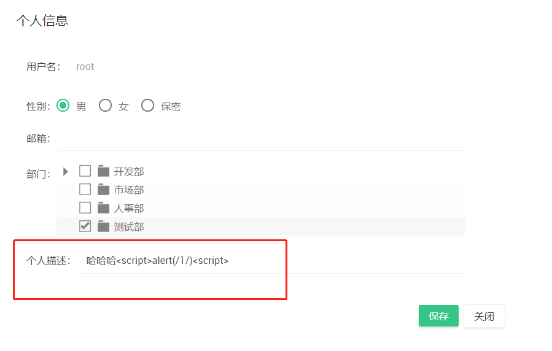
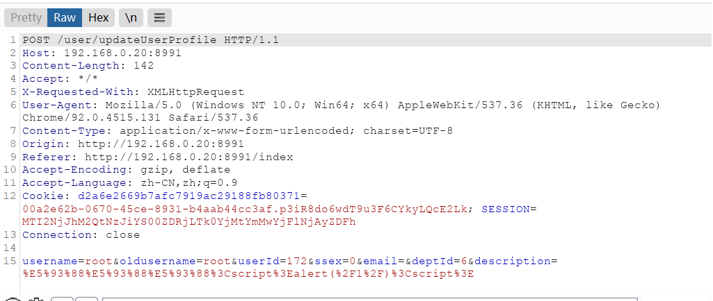
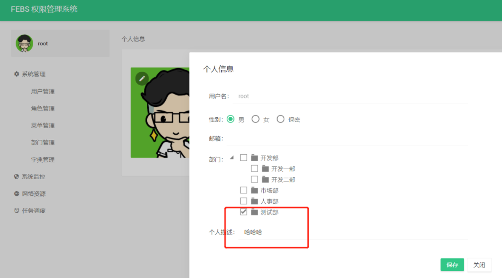

**There is a security vulnerability exists in FEBS-Security.**


[Suggested description]
The user / getuserprofile method in FEBS security project lacks the verification of userid, so that any user can modify the personal information of other users through the user / updateuserprofile method. via a Google search in url:http://localhost:8080/user/updateUserProfile


[Vulnerability Type]
Insecure permissions


[Vendor of Product] 
https://github.com/febsteam/FEBS-Security


[Affected Product Code Base] 
*


[Affected Component] //受影响的组件
POST /web_info/save.json HTTP/1.1
Host: localhost:9105
Content-Length: 213
sec-ch-ua: " Not A;Brand";v="99", "Chromium";v="92"
Accept: application/json, text/javascript, */*; q=0.01
X-Requested-With: XMLHttpRequest
sec-ch-ua-mobile: ?0
User-Agent: Mozilla/5.0 (Windows NT 10.0; Win64; x64) AppleWebKit/537.36 (KHTML, like Gecko) Chrome/92.0.4515.131 Safari/537.36
Content-Type: application/x-www-form-urlencoded; charset=UTF-8
Origin: http://localhost:9105
Sec-Fetch-Site: same-origin
Sec-Fetch-Mode: cors
Sec-Fetch-Dest: empty
Referer: http://localhost:9105/web_info/edit.action
Accept-Encoding: gzip, deflate
Accept-Language: zh-CN,zh;q=0.9,en;q=0.8
Cookie: JSESSIONID=955307B507B1FD2D9AE8E69C6EABFB75; navUrl=http://localhost:9105/admin/basic.action
Connection: close

name=Javaex%E8%AE%BA%E5%9D%9B&domain=http%3A%2F%2Fwww.javaex.cn%2F&email=291026192%40qq.com&recordNumber=%E8%8B%8FICP%E5%A4%8718008530%E5%8F%B7&license=1&statisticalCode= your xss payload


[Attack Type] 
Remote


[Proof of concept]

1.There are security vulnerabilities in the personal information modification module of this project. It is known from the source code that the function of modifying personal information is to judge the user according to the incoming userid.

```
@RequestMapping("user/getUserProfile")
@ResponseBody
public ResponseBo getUserProfile(Long userId) {
    try {
        MyUser user = new MyUser();
        user.setUserId(userId);
        return ResponseBo.ok(this.userService.findUserProfile(user));
    } catch (Exception e) {
        log.error("获取用户信息失败", e);
        return ResponseBo.error("获取用户信息失败，请联系网站管理员！");
    }
}

@RequestMapping("user/updateUserProfile")
@ResponseBody
public ResponseBo updateUserProfile(MyUser user) {
    try {
        this.userService.updateUserProfile(user);
        return ResponseBo.ok("更新个人信息成功！");
    } catch (Exception e) {
        log.error("更新用户信息失败", e);
        return ResponseBo.error("更新用户信息失败，请联系网站管理员！");
    }
}
```


2.Use burpsuite to capture packets and modify userid




3.The userid of the currently logged in user is 171, and the modified userid is 172.Enter the modify personal information page.




4.After modifying any content, click save. Get packet capture data.




5.After saving successfully, exit the current login user, switch to the user with userid 172 just modified, and enter the page of viewing personal information.Vulnerability recurrence completed.




